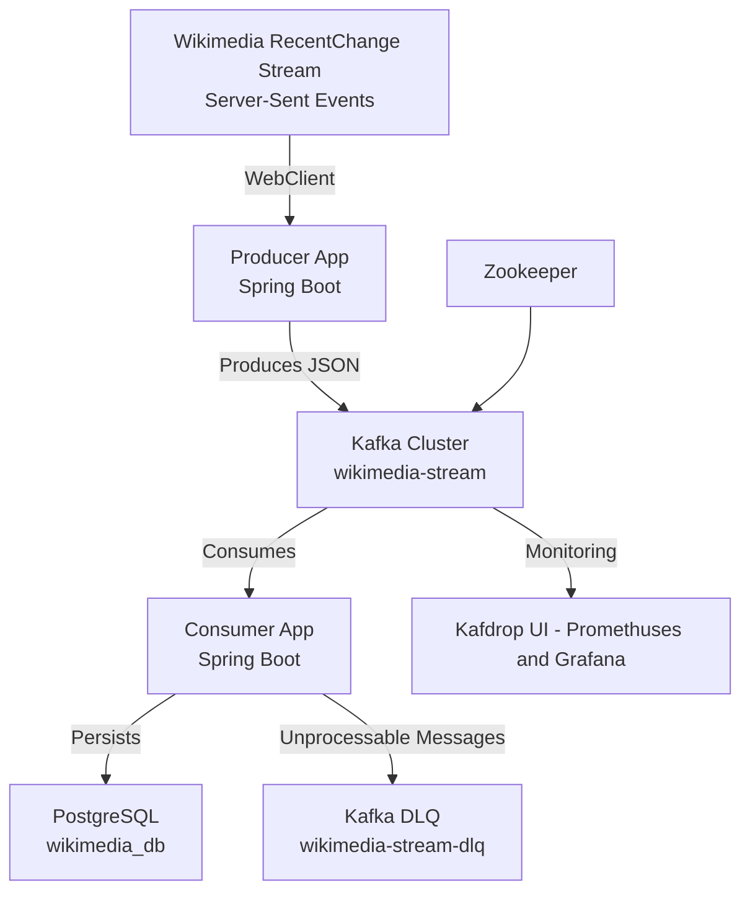
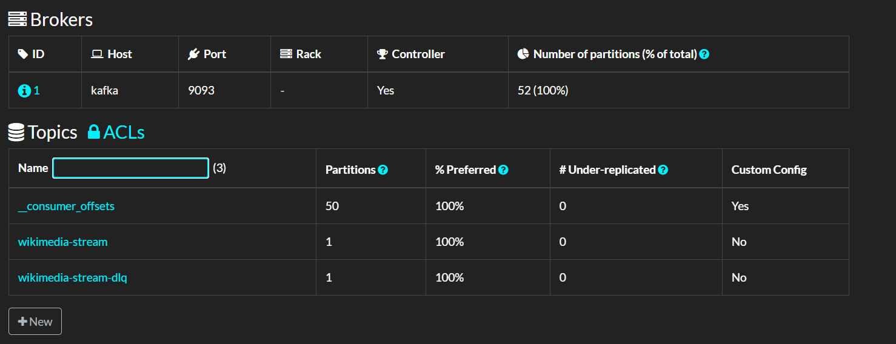
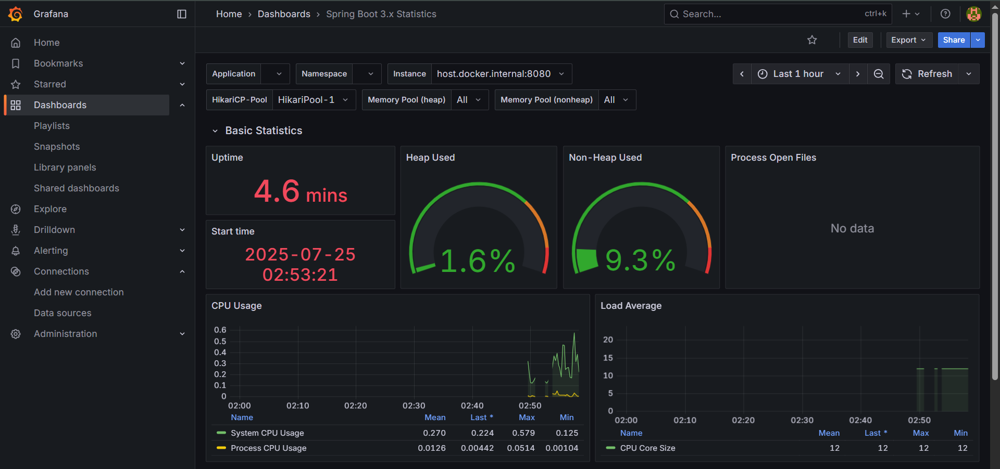
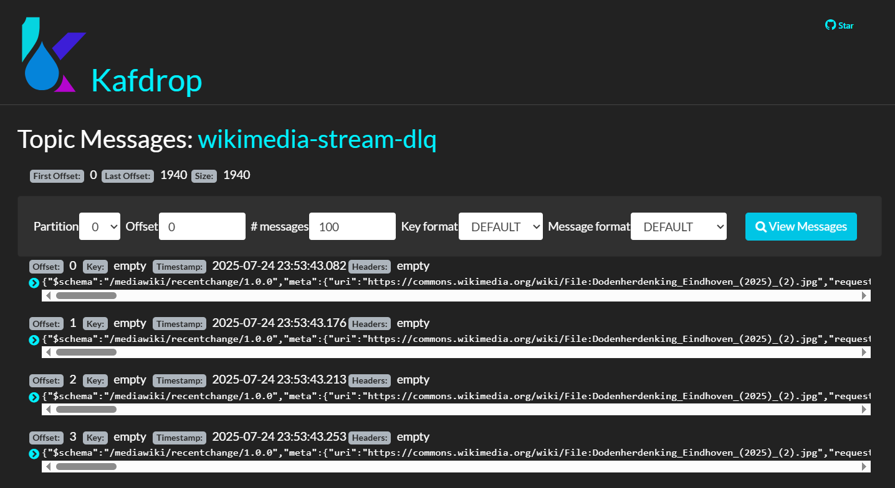
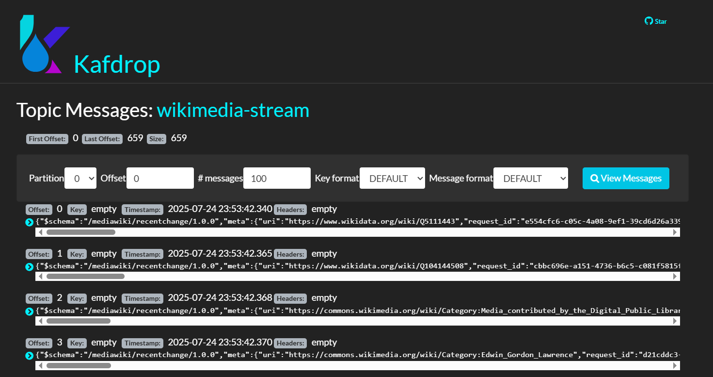
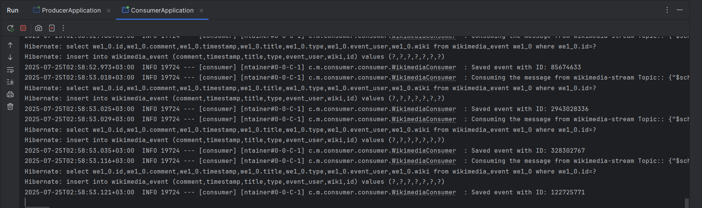
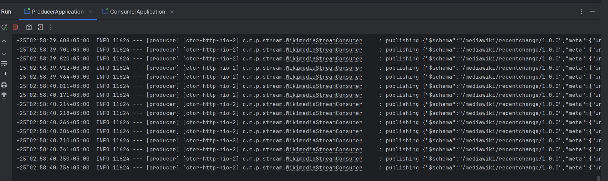

# Wikimedia Kafka Streaming Project

This project implements an event-driven architecture to process real-time data from the [Wikimedia RecentChange Stream](https://stream.wikimedia.org/v2/stream/recentchange) using **Apache Kafka**. It consists of two Spring Boot applications: a **Producer App** that streams Wikimedia events to a Kafka topic (`wikimedia-stream`) and a **Consumer App** that processes these events, persists them to a PostgreSQL database, handles errors with a Dead Letter Queue (DLQ), and implements a retry mechanism for transient failures. The Kafka cluster, Zookeeper, PostgreSQL, and Kafdrop are managed via Docker Compose for easy setup.

---

## 📌 Architecture

The architecture follows an event-driven design, leveraging Kafka for decoupled, scalable streaming. The consumer persists events to PostgreSQL, sends unprocessable messages to a DLQ (`wikimedia-stream-dlq`), and retries transient errors.



## POC


List of topics:
- consumer offsets -> topic related to consumers themselves (used to track offsets read)
- wikimedia_stream -> main topic
- wikimedia-stream-dlq -> dead letter queue in case message hasn't been successfully processed



Grafana Dashboard for the Consumer/Producer apps



Dead-letter queue topic messages


messages from wikimedia-stream



Consumer app logs


producer app logs



---

## 🚀 Producer App

**Functionality:**
- Connects to the Wikimedia RecentChange Stream via Server-Sent Events (SSE).
- Streams real-time events (e.g., page edits, categorizations) from Wikimedia.
- Produces JSON messages to the `wikimedia-stream` Kafka topic.

**Technologies:**
- Spring Boot
- WebClient utilizing Reactive Programming (WebFlux) (for SSE streaming)
- Spring Kafka Producer API
- Jackson (for JSON processing)
- Docker

**Key Files:**
- `WikimediaController.java`: REST endpoint to trigger streaming (`/api/v1/wikimedia`).
- `WikimediaStreamConsumer.java`: Handles SSE streaming and publishes to Kafka.
- `WikimediaProducer.java`: Sends messages to the `wikimedia-stream` topic.
- `WikimediaTopicConfig.java`: Configures the `wikimedia-stream` topic.
- `application.properties`: Configures Kafka (`localhost:9092`).

---

## 📥 Consumer App

**Functionality:**
- Consumes messages from the `wikimedia-stream` Kafka topic.
- Parses JSON messages into `WikimediaEvent` entities.
- Persists events to PostgreSQL (`wikimedia_db`).
- Sends unprocessable messages (e.g., missing fields) to the `wikimedia-stream-dlq` topic.
- Retries transient errors (e.g., database failures) with 3 attempts and exponential backoff.
- Logs processed and failed messages for debugging.

**Technologies:**
- Spring Boot
- Spring Kafka Consumer API
- Spring Data JPA (for PostgreSQL persistence)
- Spring Retry (for retry mechanism)
- Jackson (for JSON parsing)
- Lombok (for boilerplate reduction)

**Key Files:**
- `WikimediaConsumer.java`: Consumes messages, validates fields, persists to PostgreSQL, handles DLQ, and retries errors.
- `WikimediaEvent.java`: JPA entity for storing events (fields: `id`, `type`, `title`, `eventUser`, `timestamp`, `wiki`, `comment`).
- `WikimediaEventRepository.java`: JPA repository for database operations.
- `ConsumerApplication.java`: Main class with `@EnableRetry`.
- `application.properties`: Configures Kafka, PostgreSQL, and retry settings.

---

## 📦 Infrastructure

The project uses Docker Compose to manage:
- **Kafka**: Single-broker cluster for event streaming (`localhost:9092`).
- **Zookeeper**: Manages Kafka coordination (`localhost:2181`).
- **PostgreSQL**: Stores processed events (`localhost:5432`, database: `wikimedia_db`).
- **Kafdrop**: Web UI for monitoring Kafka topics (`http://localhost:9000`).

**Docker Compose File:**
- `docker-compose.yml`: Defines services for Kafka, Zookeeper, PostgreSQL, and Kafdrop.

---

## 🛠️ Setup Instructions

### Prerequisites
- **Java 17**: For Spring Boot apps.
- **Maven**: For building and running the apps.
- **Docker Desktop**: For running Kafka, Zookeeper, PostgreSQL, and Kafdrop (ensure at least 8GB RAM allocated).
- **Windows**: Commands are tailored for Command Prompt.

### Steps
1. **Clone the Repository**
   ```cmd
   git clone <repository-url>
   cd wikimedia-kafka-streaming
   ```

2. **Start Docker Services**
   ```cmd
   docker-compose up -d
   ```
   Verify services are running:
   ```cmd
   docker ps
   ```
   Check Kafdrop UI at `http://localhost:9000`.

3. **Run Producer App**
   ```cmd
   cd producer-app
   set SPRING_KAFKA_BOOTSTRAP_SERVERS=localhost:9092
   mvn clean install
   mvn spring-boot:run
   ```
   Trigger streaming:
   ```cmd
   curl http://localhost:8080/api/v1/wikimedia
   ```

4. **Run Consumer App**
   ```cmd
   cd consumer-app
   set SPRING_KAFKA_BOOTSTRAP_SERVERS=localhost:9092
   mvn clean install
   mvn spring-boot:run
   ```

5. **Verify**
    - **Kafdrop**: Check `wikimedia-stream` and `wikimedia-stream-dlq` topics at `http://localhost:9000`.
    - **PostgreSQL**: Query saved events:
      ```cmd
      docker exec -it postgres psql -U user -d wikimedia_db -c "SELECT * FROM wikimedia_event LIMIT 5;"
      ```
    - **Logs**: Check consumer logs for `Saved event with ID: ...` or `Sent to DLQ: ...`.
    - **Test DLQ**: Send an invalid JSON message (e.g., `{"id":"123"}`) to `wikimedia-stream` via Kafdrop to verify it goes to `wikimedia-stream-dlq`.
    - **Test Retry**: Stop PostgreSQL (`docker stop postgres`), check consumer logs for retry attempts, then restart (`docker start postgres`).

### Configuration
- **Producer App**: `producer-app/src/main/resources/application.properties`
  ```properties
  spring.kafka.producer.bootstrap-servers=localhost:9092
  spring.kafka.producer.key-serializer=org.apache.kafka.common.serialization.StringSerializer
  spring.kafka.producer.value-serializer=org.apache.kafka.common.serialization.StringSerializer
  ```
- **Consumer App**: `consumer-app/src/main/resources/application.properties`
  ```properties
  spring.kafka.consumer.bootstrap-servers=localhost:9092
  spring.kafka.consumer.group-id=myGroup
  spring.kafka.consumer.auto-offset-reset=earliest
  spring.kafka.consumer.key-deserializer=org.apache.kafka.common.serialization.StringDeserializer
  spring.kafka.consumer.value-deserializer=org.apache.kafka.common.serialization.StringDeserializer
  spring.kafka.producer.bootstrap-servers=localhost:9092
  spring.kafka.producer.key-serializer=org.apache.kafka.common.serialization.StringSerializer
  spring.kafka.producer.value-serializer=org.apache.kafka.common.serialization.StringSerializer
  spring.datasource.url=jdbc:postgresql://localhost:5432/wikimedia_db
  spring.datasource.username=user
  spring.datasource.password=password
  spring.datasource.driver-class-name=org.postgresql.Driver
  spring.jpa.hibernate.ddl-auto=update
  spring.jpa.show-sql=true
  spring.retry.max-attempts=3
  spring.retry.backoff.delay=1000
  spring.retry.backoff.multiplier=2.0
  ```


## 🌟 Future Improvements
- **REST API**: Add endpoints to query stored events or send messages to Kafka.
- **Schema Management**: Use Avro and Confluent Schema Registry for structured data and schema evolution.
- **Stream Processing**: Implement Kafka Streams or Spring Cloud Stream for real-time transformations (e.g., filtering, aggregation).
- **Kubernetes**: Deploy to Kubernetes for scalability and orchestration.
- **CI/CD**: Add GitHub Actions for automated testing and deployment.

---

## 📄 License

MIT License
