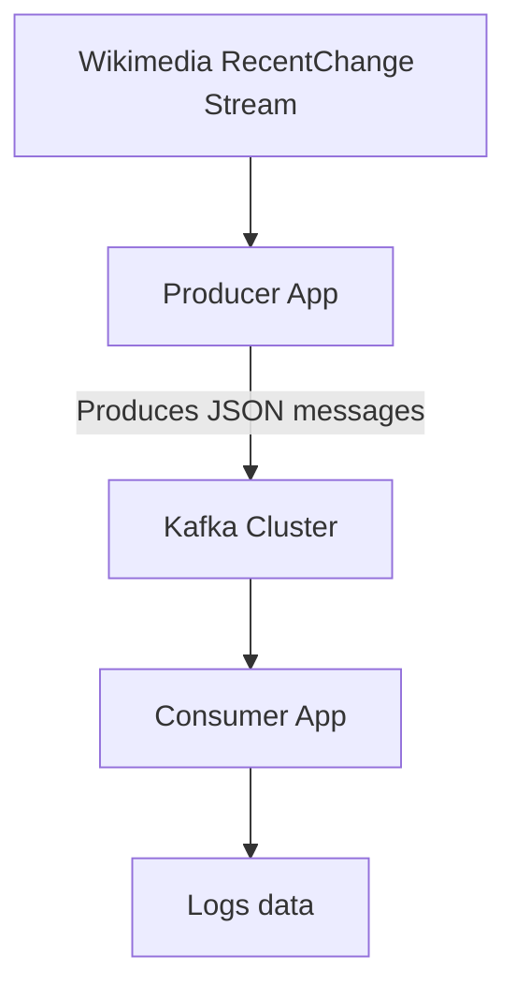

# Wikimedia Kafka Streaming Project

This project consists of two Spring Boot applications that work together to process real-time data from the [Wikimedia Recent Change Stream](https://stream.wikimedia.org/v2/stream/recentchange).  
The flow is built using **Apache Kafka** to enable decoupled, scalable streaming between services.

---

## 📌 Architecture



---

## 🚀 Producer App

**Functionality:**
- Connects to Wikimedia's EventStreams (Server-Sent Events).
- Streams real-time edit/change events.
- Produces messages to a configured Kafka topic.

**Technologies:**
- Spring Boot
- WebClient / SSE
- Kafka Producer API

---

## 📥 Consumer App

**Functionality:**
- Listens to the Kafka topic.
- Consumes messages streamed from Wikimedia.
- Currently just logs the messages for inspection.

**Technologies:**
- Spring Boot
- Kafka Consumer API

---

## 📦 Kafka Setup

- You need a running Kafka cluster (local or remote).
- Configure `bootstrap.servers` in both applications' `application.yml` or `application.properties`.

and you can setup Kafak using docker compose

```sh
docker-compose up -d
```

---

## 🛠️ Future Improvements

- Parse and persist important fields from the stream.
- Add filtering, aggregation, or transformation logic in the consumer.
- Add monitoring/metrics.

---

## 📄 License

MIT License

